## Index

- [Introduction](#introduction)
- [Diagram](#diagram)
- [Requirements](#requirements)
- [Ansible](#ansible)
  - [Playbook Command](#playbook-command)
- [AWS](#aws)
  - [Network](#network)
  - [ECS Cluster](#ecs-cluster)
  - [AWS EFS](#aws-efs)
  - [ECS Jenkins](#ecs-jenkins)
  - [Domain](#domain)
- [Application](#application)
  - [Web Console](#web-console)
  - [ECS Auto Scaling](#ecs-auto-scaling)
- [Destroy](#destroy)
  - [Via Ansible](#via-ansible)
  - [Via CloudFormation](#via-cloudformation)

## Introduction

_This pipeline via automation will deploy Jenkins on a AWS Fargate also the core infraestructure to support it._

<a href="https://www.jenkins.io/">Jenkins</a> - an open source automation server which enables developers around the world to reliably build, test, and deploy their software.

## Diagram

The below diagram shows the AWS resources.


## Requirements

1. These tools were installed:

- <a href="https://docs.aws.amazon.com/cli/latest/userguide/cli-chap-install.html">AWS Cli</a>
- <a href="https://docs.ansible.com/ansible/latest/installation_guide/intro_installation.html#installing-ansible-on-macos">Ansible</a>

2. Update the file `group_vars/all/common.yml` accordingly.

```yaml
---
cloudformation:
  check_mode_override: false
  region: ap-southeast-2
  create_changeset: true
  state: present

Route53:
  HostedZoneName: "ugulino.com."
  RecordName: "jenkins.ugulino.com"
  CertificateId: "5eaa197e" # your ACM Id

ECS:
  ASG_MinCapacity: 1
  ASG_MaxCapacity: 10
```

## Ansible

### Playbook Command

The file `deploy-role.yml` will deploy each role required to deploy this project.

```yaml
---
- hosts: localhost
  roles:
    - vpc-baseline
    - ecs-cluster
    - ecs-jenkins
    - route53
```

The below command will execute the tasks defined on the above file.

```
ansible-playbook deploy-role.yml -vvv
```

**Output**

You can verify the deployment via ansible output or via AWS CloudFormation console.

- Ansible Output:

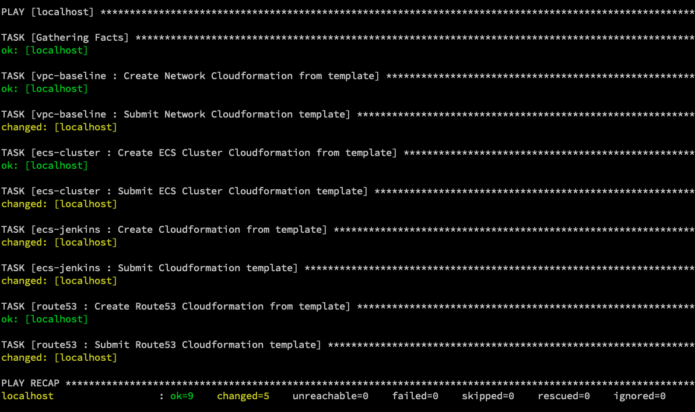

- AWS CloudFormation Console:

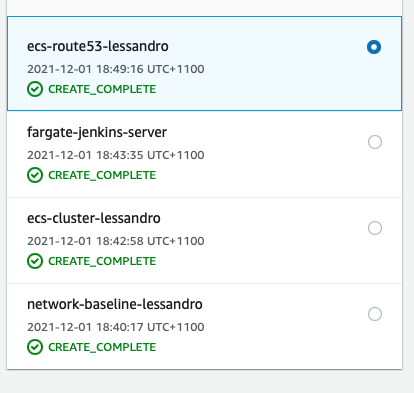

## AWS

### Network

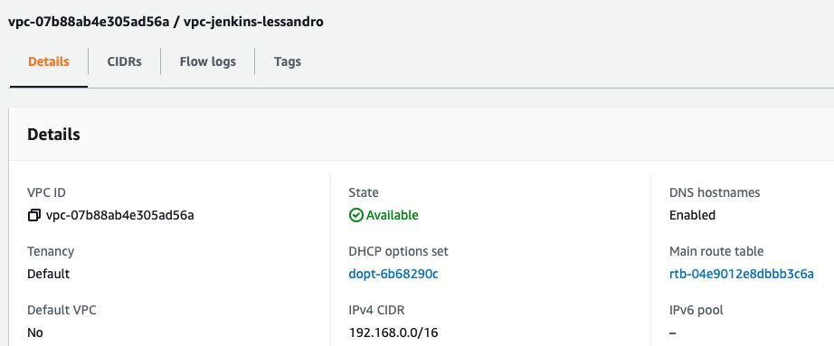

### ECS Cluster

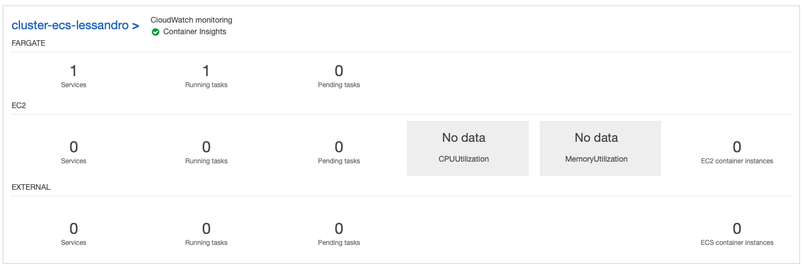

### AWS EFS

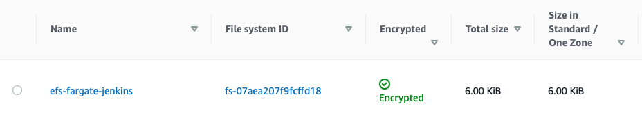

### ECS Jenkins

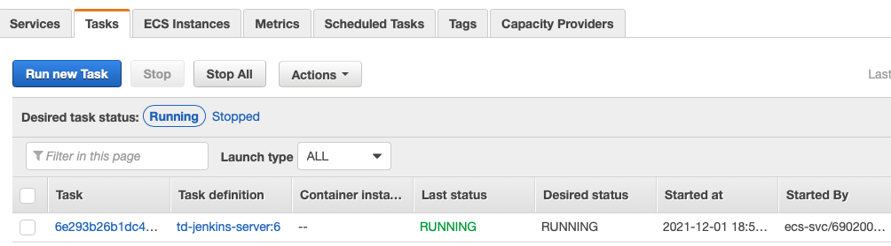

### Domain

An 'A' record was created pointing to Application Load Balancer via automation.

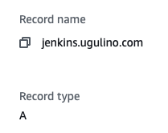

## Application

### Web Console

You can access and setup Jenkins accessing the URL https://jenkins.ugulino.com (be aware that this is my domain, probably you've setup a different one)

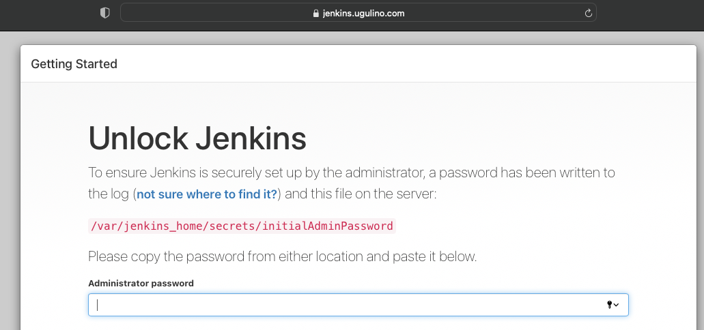

### ECS Auto Scaling

_Automatic scaling_ is the ability to increase or decrease the desired count of tasks in your Amazon ECS service automatically.

Running the below command, we can stress the environment and then test the ASG.

<a href=https://github.com/mcollina/autocannon>autocannon</a>

```
autocannon -c 200 -d 200 -m GET https://jenkins.ugulino.com
```

As soon as the CPU will be consumed more than 50%, the ECS tasks will scale up.

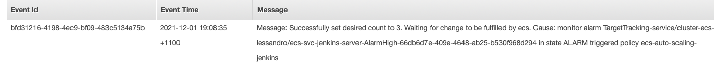

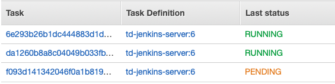

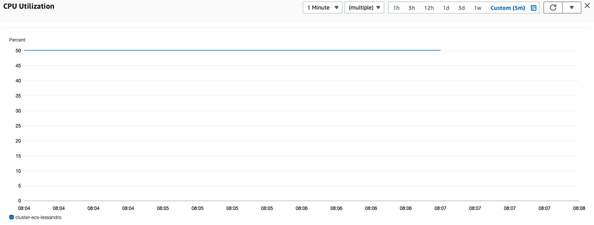

## Destroy

Basically, to destroy this deployment you can either do it via ansible command or AWS CloudFormation.

### Via Ansible

Change the file `group_vars/all/common.yml`

```yaml
cloudformation:
  check_mode_override: false
  region: ap-southeast-2
  create_changeset: true
  state: absent # this is the value you need to change to destroy the stacks
```

Execute the command:

```
ansible-playbook deploy-role.yml -vvv
```

### Via CloudFormation

Select the CloudFormation stack, click delete, and then _Delete stack_.

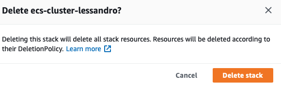
